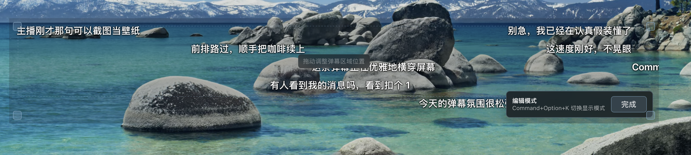
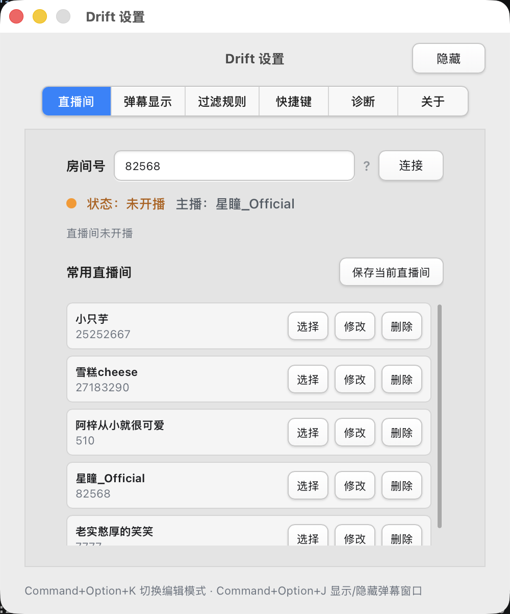

# Drift

Drift 是一款桌面顶层透明弹幕悬浮工具。它可以连接 B 站直播间，把实时弹幕显示在桌面透明窗口上，适合边听直播，边学习、工作或打游戏时使用。

> 小提示：独占全屏游戏通常会遮住桌面悬浮窗口。如果想在游戏时显示弹幕，建议把游戏显示模式调整为“无边框窗口”或“窗口化全屏”。

## 功能特性

- B 站直播间弹幕实时接入。
- 透明、置顶、无边框弹幕窗口。
- 鼠标穿透显示模式，不影响操作桌面和其他应用。
- 编辑模式下可拖动和调整弹幕区域。
- 支持普通弹幕、普通送礼消息和上舰消息基础显示。
- 支持弹幕显示开关、字号、透明度、速度、密度和用户名显示设置。
- 支持高级过滤规则，可按文本、用户名、消息类型、礼物名隐藏或高亮消息。
- 支持弹幕历史抽屉，可搜索和复制最近弹幕。
- 支持 B 站扫码登录，登录凭据保存在系统安全存储中。
- 登录并连接直播间后，可通过快捷键打开发送窗口发送普通文本弹幕。
- 支持 API 诊断、日志目录打开和诊断报告导出，便于排查连接、登录和发送问题。

## 界面预览

普通显示模式：


编辑模式：



设置页面：



## 下载安装

前往 Releases 页面下载：

[Download Drift](https://github.com/proudzhao/Drift/releases)

macOS 用户下载 `.dmg` 文件：

- Apple Silicon：下载 `aarch64.dmg`
- Intel Mac：下载 `x64.dmg`

Windows 用户下载 `.exe` 或 `.msi` 安装包。

> 当前版本尚未进行 macOS Developer ID 签名和 Apple 公证。macOS 可能会提示“无法验证开发者”或“应用已损坏，无法打开”。如果你确认安装包来自本仓库 Releases 页面，可以将应用拖入“应用程序”后执行：
>
> ```bash
> xattr -dr com.apple.quarantine /Applications/drift.app
> ```

## 基础使用

1. 启动 Drift。
2. 打开设置窗口。
3. 在“直播间”页输入 B 站直播间房间号。
4. 点击“连接”。
5. 弹幕会显示在透明悬浮窗口中。
6. 调整好窗口区域后，点击“完成”进入鼠标穿透显示模式。

默认快捷键：

```text
切换编辑模式
macOS: Command+Option+K
Windows / Linux: Control+Alt+K

显示或隐藏弹幕窗口
macOS: Command+Option+J
Windows / Linux: Control+Alt+J

打开发送弹幕窗口
macOS: Command+Option+Enter
Windows / Linux: Control+Alt+Enter
```

如果快捷键与其他应用冲突，可以在设置窗口的“快捷键”页修改。

## 设置说明

设置窗口包含以下页面：

- 直播间：连接或断开直播间，查看主播名称，管理常用直播间。
- 弹幕显示：调整字号、透明度、滚动速度、显示密度、用户名显示和消息类型开关。
- 过滤规则：添加高级过滤规则，用于隐藏或高亮指定弹幕。
- 快捷键：修改编辑模式、弹幕窗口显示/隐藏、发送弹幕窗口快捷键。
- 诊断：测试 B 站 API 链路，打开日志目录，导出诊断报告，启用 Mock 弹幕测试。
- 账号：扫码登录 B 站，查看账号状态，校验登录态，退出登录。
- 关于：查看当前版本，手动检查更新。

## 登录与发送弹幕

发送弹幕需要先登录 B 站，并且当前已经连接直播间。

推荐流程：

1. 打开设置窗口的“账号”页。
2. 点击扫码登录，并使用 B 站客户端扫码确认。
3. 回到“直播间”页连接直播间。
4. 使用发送弹幕快捷键打开发送窗口。
5. 输入普通文本弹幕后按 Enter 或点击发送。
6. 点击“x”按钮 或 按下 Esc 按键关闭发送窗口

发送说明：

- Drift 只支持普通文本弹幕发送。
- 单条弹幕长度限制为 60 个 Unicode 字符。
- 本地会限制连续发送频率，避免误触造成高频发送。

## macOS 钥匙串密码提示说明

在 macOS 上使用扫码登录、校验登录状态、发送弹幕或退出登录时，系统可能会弹出“Drift 想要访问钥匙串”之类的密码窗口。这是 macOS Keychain 的系统安全机制，不是 Drift 自己绘制的密码框，也不是在索要你的密码。

Drift 使用钥匙串保存 B 站登录后得到的 Cookie 信息，目的是避免把敏感登录凭据明文写入配置文件。保存项使用：

```text
Service: com.proudzhao.drift.bilibili.auth
Account: bilibili-cookie-bundle
```

需要强调：

- Drift 不会读取、保存或上传你的 macOS 登录密码。
- macOS 密码只由系统钥匙串窗口接收，用于确认你允许 Drift 访问它自己保存的 B 站登录凭据。
- Drift 的诊断报告和日志不会输出完整 Cookie、`SESSDATA`、`bili_jct`、`refresh_token` 或完整请求头。
- 如果你拒绝钥匙串访问，Drift 仍可匿名接收弹幕，但账号状态、登录态请求和发送弹幕可能不可用。

如果你不想继续保留登录状态，可以在设置窗口“账号”页点击退出登录，Drift 会删除本机保存的 B 站登录凭据。

## 诊断与反馈

如果连接失败、登录状态异常或发送弹幕失败，可以在设置窗口“诊断”页：

1. 点击“测试 API”检查当前直播间相关 B 站接口。
2. 点击“打开日志目录”查看本机日志。
3. 点击“导出诊断报告”生成文本报告。

诊断报告会包含应用版本、系统信息、最近日志、当前配置、B 站认证状态和弹幕发送状态。报告会做脱敏处理，不会包含完整 Cookie、CSRF 或弹幕正文。

## 本地开发

项目基于 Tauri、React、TypeScript 和 Rust。

环境要求：

- Node.js
- npm
- Rust
- Tauri 所需系统依赖

安装依赖：

```bash
cd drift
npm install
```

启动开发模式：

```bash
npm run tauri dev
```

构建应用：

```bash
npm run tauri build
```

## 项目结构

```text
Drift/
├── drift/
│   ├── src/              # React / TypeScript 前端
│   ├── src-tauri/        # Tauri / Rust 后端
│   ├── package.json
│   └── vite.config.ts
├── .github/workflows/    # GitHub Actions 发布流程
├── assets/               # README 截图资源
└── README.md
```
